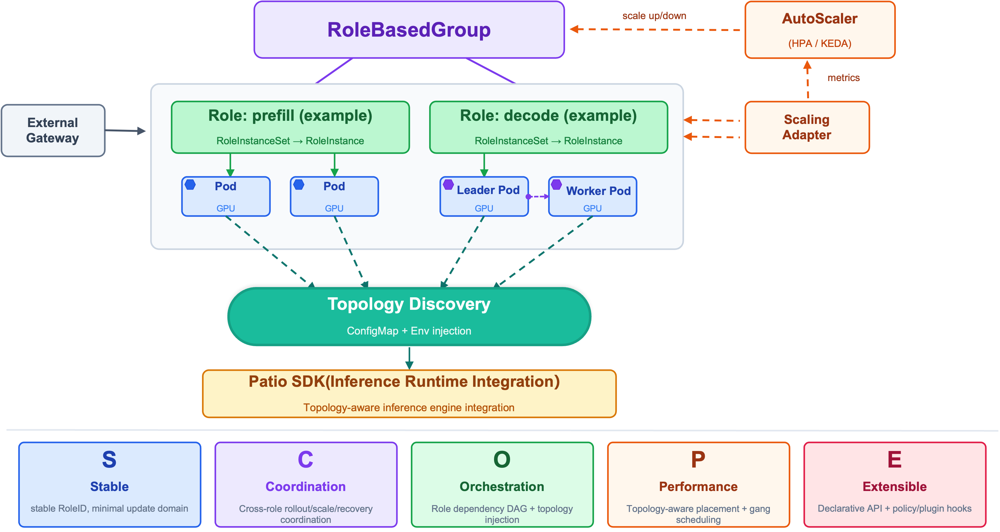

# RoleBasedGroup (RBG) 🚀

English | [简体中文](./README-zh_CN.md)

[](https://github.com/sgl-project/rbg/blob/main/LICENSE)
[](https://github.com/sgl-project/rbg/releases)
[](https://goreportcard.com/report/github.com/sgl-project/rbg)

> 🎯 A Kubernetes API for orchestrating distributed, stateful AI inference workloads with **multi-role collaboration** and **built-in service discovery**.

**🌐 Official Website**: [rolebasedgroup.github.io](https://rolebasedgroup.github.io)

---

## 🏗️ Architecture



---

## 📰 Latest News

| Date | Release | Highlights |
|:----:|:-------:|:-----------|
| 2026-04-22 | [v0.7.0-alpha.3](https://github.com/sgl-project/rbg/releases/tag/v0.7.0-alpha.3) | `v1alpha2` conversion webhooks, CLI multi-node LLM serving |
| 2026-03-31 | [v0.7.0-alpha.2](https://github.com/sgl-project/rbg/releases/tag/v0.7.0-alpha.2) | Pod port allocator, CLI foundations |
| 2026-03-18 | [v0.7.0-alpha.1](https://github.com/sgl-project/rbg/releases/tag/v0.7.0-alpha.1) | `v1alpha2` API, coordinated policies, gang scheduling |
| 2026-02-18 | [v0.6.0](https://github.com/sgl-project/rbg/releases/tag/v0.6.0) | Coordinated scaling, stateful InstanceSet |
| 2025-12-03 | [v0.5.0](https://github.com/sgl-project/rbg/releases/tag/v0.5.0) | Native InstanceSet, in-place updates, Mooncake integration |
| 2025-09-23 | [v0.4.0](https://github.com/sgl-project/rbg/releases/tag/v0.4.0) | RBGS scaling, Volcano podgroup support |

---

## 🤔 Why RBG?

Traditional Kubernetes primitives (StatefulSets / Deployments) struggle with LLM inference services that:

| Challenge | Description |
|:---------:|:------------|
| Multi-role topologies | gateway → router → prefill → decode |
| Performance-sensitive | GPU/network topology matters |
| Atomic operations | deploy, upgrade, scale, failover across roles |

**RBG** treats an inference service as a **role-based group** — a topologized, stateful, coordinated multi-role organism managed as a single unit.

---

## 🎯 Key Concepts

| Concept | Description |
|:--------|:------------|
| **Role** | Basic scheduling and rollout unit. Each role (prefill, decode) has its own spec, lifecycle and policies. |
| **RoleBasedGroup** | A group of roles forming one logical service (e.g., one LLM inference deployment). |
| **RoleInstance** | A collection of Pods with tightly bound lifecycle. Supports in-place updates and controls upgrades/status for the Pod group. |
| **CoordinatedPolicy** | A separate CRD for coordinating operations across roles. Controls `maxSkew` and `progression` during rolling updates and scaling. |

---

## ✨ Key Features — SCOPE

| Capability | Description |
|:-----------|:------------|
| **Stable** | Topology-aware deterministic operations with unique RoleID injection |
| **Coordination** | Cross-role policy engine: deployment pairing, coordinated upgrades, linked recovery |
| **Orchestration** | Role dependencies, precise startup sequences, topology self-aware service discovery |
| **Performance** | Hardware affinity scheduling: GPU-NVLink → PCIe → RDMA → VPC |
| **Extensible** | Declarative APIs and plugin mechanisms for future architectures |

---

## 🚀 Getting Started

### 📦 Installation

Install from [GitHub Releases](https://github.com/sgl-project/rbg/releases) (latest version):

```shell
VERSION=$(curl -sL https://api.github.com/repos/sgl-project/rbg/releases/latest | grep '"tag_name"' | sed -E 's/.*"v([^"]+)".*/\1/')
helm upgrade --install rbgs https://github.com/sgl-project/rbg/releases/download/v$VERSION/rbgs-$VERSION.tgz \
            --namespace rbgs-system --create-namespace --wait
```

For detailed instructions, see [Installation Guide](doc/install.md).

### 🎮 Quick Start

Deploy a basic RoleBasedGroup with two roles and startup dependencies:

```yaml
apiVersion: workloads.x-k8s.io/v1alpha2
kind: RoleBasedGroup
metadata:
  name: nginx-cluster
spec:
  roles:
    - name: frontend
      replicas: 1
      standalonePattern:
        template:
          spec:
            containers:
              - name: nginx
                image: nginx:1.14.1
                ports:
                  - containerPort: 80

    - name: backend
      replicas: 3
      dependencies: ["frontend"]  # backend starts after frontend is ready
      standalonePattern:
        template:
          spec:
            containers:
              - name: nginx
                image: nginx:1.14.1
                ports:
                  - containerPort: 8080
```

### Deployment Patterns

| Pattern | Used For | Description |
|:--------|:---------|:------------|
| **standalonePattern** | Single-node deployment | Single pod per instance |
| **leaderWorkerPattern** | Multi-node distributed deployment | Leader + workers for tensor parallelism |

### RoleTemplates

Reduce configuration duplication with reusable templates:

```yaml
spec:
  roleTemplates:
    - name: base-template
      template:
        spec:
          containers:
            - name: nginx
              image: nginx:1.14.1

  roles:
    - name: frontend
      replicas: 2
      standalonePattern:
        templateRef:
          name: base-template

    - name: backend
      replicas: 3
      standalonePattern:
        templateRef:
          name: base-template
          patch:  # role-specific overrides
            spec:
              containers:
                - name: nginx
                  resources:
                    requests:
                      memory: "128Mi"
```

---

## 🖥️ CLI Tool

kubectl-rbg is a CLI tool for managing RBG resources and LLM deployments.

### Installation

```shell
# Build from source
make build-cli
chmod +x bin/kubectl-rbg
sudo mv bin/kubectl-rbg /usr/local/bin/
```

### LLM Quick Start

```shell
# Initialize configuration
kubectl rbg llm config init

# Pull a model
kubectl rbg llm model pull Qwen/Qwen3.5-0.8B

# Deploy as inference service
kubectl rbg llm svc run my-qwen Qwen/Qwen3.5-0.8B

# Chat with the service
kubectl rbg llm svc chat my-qwen
```

For detailed CLI documentation, see [kubectl-rbg](doc/cli/kubectl-rbg.md).

---

## 🧠 Inference Examples

### Prefill/Decode Disaggregated

SGLang PD-disaggregated examples in `examples/inference/`:

| Example | Pattern | Description |
|:--------|:--------|:------------|
| [pd-disagg-standalone.yaml](examples/inference/pd-disagg-standalone.yaml) | standalonePattern | Single pod per role, suitable for single-GPU instances |
| [pd-disagg-leader-worker.yaml](examples/inference/pd-disagg-leader-worker.yaml) | leaderWorkerPattern | Multi-GPU tensor parallelism for decode role |

### Aggregated Inference

SGLang aggregated examples:

| Example | Pattern | Description |
|:--------|:--------|:------------|
| [agg-standalone.yaml](examples/inference/agg-standalone.yaml) | standalonePattern | Single-GPU aggregated inference |
| [agg-leader-worker.yaml](examples/inference/agg-leader-worker.yaml) | leaderWorkerPattern | Multi-GPU tensor parallelism |

---

## 🔗 Ecosystem Integration

RBG integrates with ecosystem components for production LLM inference:

### NVIDIA Dynamo

[NVIDIA Dynamo](https://github.com/ai-dynamo/dynamo) is an open-source, datacenter-scale inference stack that orchestrates multi-node AI workloads above inference engines like vLLM and SGLang:

| Example | Description |
|:--------|:------------|
| [dynamo/pd-disagg.yaml](examples/inference/ecosystem/dynamo/pd-disagg.yaml) | PD-disaggregated with Dynamo SGLang runtime |
| [dynamo/pd-disagg-multi-nodes.yaml](examples/inference/ecosystem/dynamo/pd-disagg-multi-nodes.yaml) | Multi-node PD-disaggregated |
| [dynamo/agg.yaml](examples/inference/ecosystem/dynamo/agg.yaml) | Aggregated inference with Dynamo |
| [dynamo/agg-multi-nodes.yaml](examples/inference/ecosystem/dynamo/agg-multi-nodes.yaml) | Multi-node aggregated |

### Mooncake

[Mooncake](https://github.com/kvcache-ai/Mooncake) is a disaggregated architecture for LLM serving, providing KV cache transfer and reuse across distributed inference:

| Example | Description |
|:--------|:------------|
| [mooncake-store/pd-disagg-kvcache-reuse-with-mooncake.yaml](examples/inference/ecosystem/mooncake/mooncake-store/pd-disagg-kvcache-reuse-with-mooncake.yaml) | PD-disaggregated with KV cache reuse |
| [mooncake-store/agg-kvcache-reuse-with-mooncake.yaml](examples/inference/ecosystem/mooncake/mooncake-store/agg-kvcache-reuse-with-mooncake.yaml) | Aggregated with KV cache reuse |
| [mooncake-transfer-engine/sgl-pd-disagg-with-mooncake-te.yaml](examples/inference/ecosystem/mooncake/mooncake-transfer-engine/sgl-pd-disagg-with-mooncake-te.yaml) | SGLang PD-disaggregated with transfer engine |
| [mooncake-transfer-engine/vllm-pd-disagg-with-mooncake-te.yaml](examples/inference/ecosystem/mooncake/mooncake-transfer-engine/vllm-pd-disagg-with-mooncake-te.yaml) | vLLM PD-disaggregated with transfer engine |

---

## 📂 Examples Directory

### 🧱 Basic Examples (`examples/basic/`)

| Path | Description |
|:-----|:------------|
| `rbg/base.yaml` | Basic RoleBasedGroup with role dependencies |
| `rbg/dependency/` | Role dependency configurations |
| `rbg/patterns/` | Deployment patterns: standalone, leader-worker, custom-components |
| `rbg/scheduling/` | Gang scheduling: Volcano, scheduler-plugins |
| `rbg/update-strategy/` | Rolling update with partition support |
| `rbg/restart-policy/` | Restart policy configurations |
| `rbg/scaling/` | Scaling adapter with HPA integration |
| `rbg/role-template/` | RoleTemplates for reducing duplication |
| `coordinated-policy/` | Coordinated rollout and scaling policies |
| `engine-runtime/` | Engine runtime profile configurations |

### 🧠 Inference Examples (`examples/inference/`)

| Path | Description |
|:-----|:------------|
| `agg-standalone.yaml` | Aggregated SGLang (standalone pattern) |
| `agg-leader-worker.yaml` | Aggregated (leader-worker pattern) |
| `pd-disagg-standalone.yaml` | Prefill/Decode disaggregated (standalone) |
| `pd-disagg-leader-worker.yaml` | Prefill/Decode disaggregated (leader-worker) |
| `ecosystem/` | NATS, etcd, Dynamo, Mooncake integration |
| `ecosystem/dynamo/` | NVIDIA Dynamo runtime examples |
| `ecosystem/mooncake/` | Mooncake KV cache transfer engine |

---

## 📚 Documentation

| Source | Link |
|:-------|:-----|
| **Official Docs** | [rolebasedgroup.github.io](https://rolebasedgroup.github.io) |
| **Local Docs** | [doc/TOC.md](doc/TOC.md) |

### Version Compatibility

| RBG Version | Kubernetes | LeaderWorkerSet |
|:------------|:----------:|:---------------:|
| main / v0.7.0-alpha.x | >=v1.22.x | Not Required |
| v0.6.0 | >=v1.28.x | >=v0.7.0 |
| v0.5.0 | >=v1.28.x | >=v0.6.0 |
| v0.4.0 | >=v1.28.x | >=v0.7.0 |

---

## 🤝 Contributing

We welcome contributions! See [CONTRIBUTING.md](CONTRIBUTING.md) for guidelines.

```shell
# Verify copyright headers
make copyright-check

# Add missing headers
make copyright-fix
```

---

## 💬 Community

| Channel | Link |
|:--------|:-----|
| **Slack** | [#rbg channel](https://sgl-fru7574.slack.com/archives/C098X0LQZV5) |
| **Issues** | [GitHub Issues](https://github.com/sgl-project/rbg/issues) |
| **Discussions** | [Community Discussions](https://github.com/sgl-project/rbg/discussions) |

### 📜 Code of Conduct

This project follows the [Kubernetes Code of Conduct](doc/code-of-conduct.md).

---

## 🙏 Acknowledgment

RBG is inspired by and reuses code from [LeaderWorkerSet (LWS)](https://github.com/kubernetes-sigs/lws).